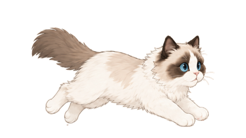

# Ragdoll Progress

A small Chrome extension that keeps the native progress bars on YouTube, Bilibili, and Douyin intact and adds a cute running ragdoll cat above the scrubber.



## Load In Chrome

```bash
git clone https://github.com/wcqqq1214/ragdoll-progress.git
cd ragdoll-progress
```

1. Open `chrome://extensions`.
2. Enable **Developer mode**.
3. Click **Load unpacked**.
4. Select the cloned `ragdoll-progress` folder, which contains `manifest.json`.
5. Open or refresh a YouTube, Bilibili, or Douyin video page.

## License

MIT
