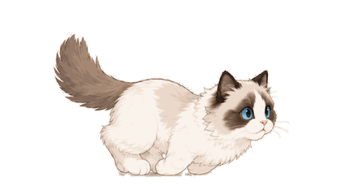

# Ragdoll Progress

A small Chrome extension that keeps native video progress bars intact and adds a cute running ragdoll cat above the scrubber.



## Supported Platforms

[](https://www.youtube.com/)
[](https://www.bilibili.com/)
[](https://www.douyin.com/)
[](https://www.tiktok.com/)

## Load In Chrome

```bash
git clone https://github.com/wcqqq1214/ragdoll-progress.git
cd ragdoll-progress
```

1. Open `chrome://extensions`.
2. Enable **Developer mode**.
3. Click **Load unpacked**.
4. Select the cloned `ragdoll-progress` folder, which contains `manifest.json`.
5. Open or refresh a supported video page.

## License

MIT
