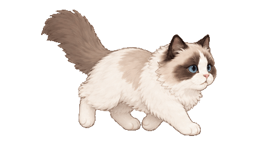

# Ragdoll Progress

**v0.5.1**

A Chrome extension that adds Fanqie the ragdoll to native video progress bars.
Runs during playback, rests when paused, and sleeps when finished.
Respects reduced-motion preferences.

  

[Interactive preview](assets/preview.html) — open locally.

## Supported Platforms

## Install

1. Open `chrome://extensions` and enable **Developer mode**.
2. Click **Load unpacked** and select the folder containing `manifest.json`.
3. Refresh your video page.

After updating, reload the extension and refresh your video tabs.

## License

MIT
